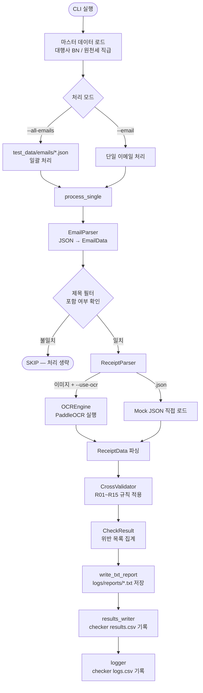
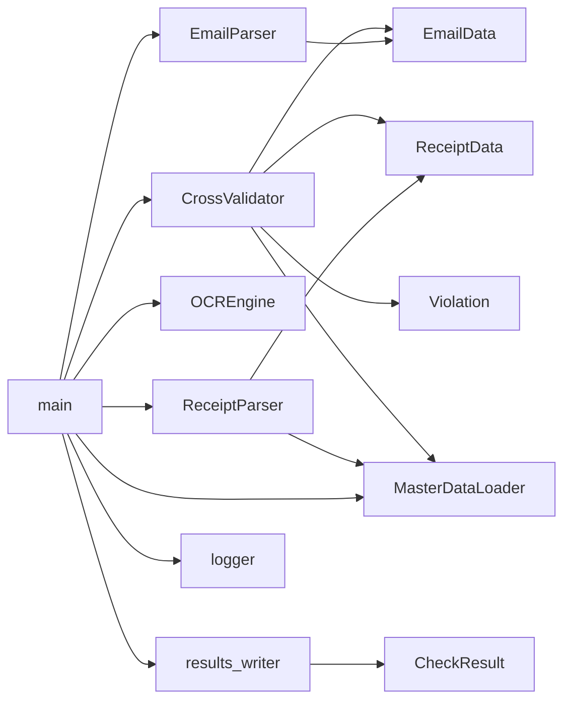

# 신용카드 영수증 점검 시스템 — 운영·개발 가이드

> 최종 업데이트: 2026-04-12
> 대상 독자: 시스템 운영자 / 유지보수 개발자

---

## 목차

1. [프로젝트 개요](#1-프로젝트-개요)
2. [환경 구축](#2-환경-구축)
3. [시스템 아키텍처](#3-시스템-아키텍처)
4. [입출력 데이터 명세](#4-입출력-데이터-명세)
5. [점검 규칙 (R01 ~ R15)](#5-점검-규칙-r01--r15)
6. [실행 방법](#6-실행-방법)
7. [설정값 참조 (config.py)](#7-설정값-참조-configpy)
8. [코드 명세서](#8-코드-명세서)
9. [파일 명세서](#9-파일-명세서)
10. [유지보수 가이드](#10-유지보수-가이드)

---

## 1. 프로젝트 개요

### 목적

SAP/NERP에서 내려오는 **신용카드 결제 승인 이메일**을 자동으로 분석하여, 첨부된 영수증 이미지와 교차 검증 후 15개 비즈니스 규칙(R01~R15)을 적용한다. 점검 결과는 TXT 파일로 저장하고, 처리 이력은 CSV로 누적 기록한다.

### 처리 대상 필터

이메일 제목에 아래 문자열이 포함된 건만 처리한다.

```
[myF] 신용카드 경비
```

### 주요 기능 요약

| 기능 | 설명 |
|------|------|
| 이메일 파싱 | SAP 이메일 JSON → 구조화된 데이터 |
| OCR | 영수증 이미지 텍스트 추출 (PaddleOCR) |
| 교차 검증 | 이메일 본문 ↔ 영수증 15개 규칙 자동 검증 |
| 점검 리포트 | TXT 파일 저장 (`logs/reports/년월일_기안자ID_삼성전표번호.txt`) |
| 로그 기록 | 상세 로그 CSV + 이메일 단위 결과 CSV |

---

## 2. 환경 구축

### 2.1 사전 요구사항

| 항목 | 버전 | 비고 |
|------|------|------|
| Python | 3.13 | 3.10 이상 권장 (`str \| Path` 문법 사용) |
| OS | Windows 11 | Linux/macOS 가능하나 OCR 경로 확인 필요 |
| pip | 최신 | `python -m pip install --upgrade pip` |

### 2.2 OCR 도구 비교

영수증 이미지 분석에 적합한 도구를 비교한 후 **PaddleOCR**를 선택하였다.

| 항목 | **PaddleOCR** ✅ | Tesseract | EasyOCR | Google Vision API | Naver Clova OCR |
|------|:-:|:-:|:-:|:-:|:-:|
| 한글 정확도 | ★★★★★ | ★★★ | ★★★★ | ★★★★★ | ★★★★★ |
| 영수증 특화 | ★★★★ | ★★ | ★★★ | ★★★★ | ★★★★★ |
| 오프라인 동작 | ✅ | ✅ | ✅ | ❌ | ❌ |
| 비용 | 무료 | 무료 | 무료 | 유료(무료 한도) | 유료 |
| Windows 지원 | ✅ (주의사항 있음) | ✅ | ✅ | ✅ | ✅ |
| Python 라이브러리 | ✅ | ✅ | ✅ | ✅ | ✅ |
| 회전/왜곡 보정 | ✅ | ❌ | 부분 | ✅ | ✅ |
| 모델 크기 | ~100MB | ~50MB | ~200MB | 클라우드 | 클라우드 |
| 설치 난이도 | 중 | 하 | 하 | 하 | 하 |

**선택 이유**: 오프라인 동작, 무료, 높은 한글 정확도, 영수증 레이아웃 인식 지원.
**단점**: Windows CPU 환경에서 oneDNN 버그 존재 → 아래 섹션 참조.

### 2.3 패키지 설치

```bash
pip install paddleocr paddlex
```

> `requirements.txt`가 없으므로 위 명령으로 직접 설치한다.
> numpy, pillow, opencv 등 하위 의존성은 paddleocr가 자동 설치한다.

### 2.4 Windows CPU 환경 주의사항 (oneDNN 버그)

PaddleOCR 3.x는 Windows CPU 모드에서 두 가지 알려진 버그가 있다.
`core/ocr_engine.py`에서 자동으로 우회 처리하므로 별도 조치 불필요.

| 버그 | 증상 | 적용된 우회 방법 |
|------|------|----------------|
| oneDNN 모델 소스 체크 오류 | 초기화 시 `RuntimeError` | 환경변수 `PADDLE_PDX_DISABLE_MODEL_SOURCE_CHECK=True` 설정 |
| `get_default_run_mode` 오류 | `AttributeError` 발생 | 해당 함수를 `"paddle"` 반환으로 monkey-patch |

### 2.5 디렉토리 구조

```
CreditCardVerifier/
├── main.py                     # CLI 진입점
├── config.py                   # 전역 설정 (상수, 경로)
├── inspection_rules.json       # 점검 규칙 정의 문서
│
├── models/                     # 데이터 모델 (dataclass)
│   ├── __init__.py
│   ├── email_data.py           # EmailData, Submitter, Payment 등
│   ├── receipt_data.py         # ReceiptData
│   └── check_result.py         # CheckResult, Violation, CheckStatus
│
├── core/                       # 핵심 처리 로직
│   ├── email_parser.py         # JSON → EmailData
│   ├── receipt_parser.py       # OCR 텍스트 → ReceiptData
│   ├── ocr_engine.py           # PaddleOCR 래퍼
│   ├── cross_validator.py      # R01~R15 교차 검증
│   ├── logger.py               # 콘솔 + CSV 로깅
│   └── results_writer.py       # checker results.csv 기록
│
├── master/                     # 마스터 데이터 로더
│   └── master_data_loader.py
│
├── notifier/                   # (미사용, 레거시)
│   └── email_notifier.py
│
├── master_data/                # 마스터 데이터 CSV (수동 관리)
│   ├── 대행사_사업자번호.csv
│   └── 원천세_직급.csv
│
├── test_data/                  # 테스트용 샘플 데이터
│   ├── emails/                 # 이메일 JSON (email_*.json)
│   └── receipts/               # Mock 영수증 JSON (receipt_mock_*.json)
│
├── logs/                       # 실행 시 자동 생성
│   ├── checker logs.csv        # 전체 누적 상세 로그
│   └── checker results.csv     # 이메일 단위 처리 결과
│
└── docs/
    └── GUIDE.md                # 이 문서
```

---

## 3. 시스템 아키텍처

### 3.1 전체 처리 흐름



### 3.2 모듈 의존관계



---

## 4. 입출력 데이터 명세

### 4.1 이메일 JSON 구조

이메일 JSON은 SAP/NERP에서 내려오는 형식이며, 테스트 시에는 `test_data/emails/`에 직접 작성한다.

```json
{
  "email_id": "EMAIL-2026-0412-001",
  "subject": "[myF] 신용카드 경비 - 강남 한식당 55,000원",
  "samsung_doc_no": "2600412001",
  "submitted_at": "2026-04-12T10:30:00",
  "submitter": {
    "employee_id": "20191234",
    "knox_id": "cwkim",
    "name": "김철우",
    "department": "DEV팀",
    "department_code": "DEV001",
    "email": "cwkim@samsung.com"
  },
  "approver": {
    "name": "이부장",
    "department": "DEV팀",
    "department_code": "DEV001"
  },
  "payment": {
    "approval_no": "12345678",
    "card_no_masked": "1234-****-****-5678",
    "merchant_name": "강남 한식당",
    "biz_no": "123-45-67890",
    "payment_date": "2026-04-10",
    "posting_date": "2026-04-12",
    "document_date": "2026-04-10",
    "total_amount": 55000,
    "vat_amount": 5000,
    "supply_amount": 50000
  },
  "accounting": {
    "account_code": "복리후생비",
    "account_name": "복리후생비-기타-기타",
    "origin_cost_center": "DEV001",
    "assigned_cost_center": "DEV001",
    "tax_code": "V1",
    "nontax_reason": "해당사항없음",
    "withholding_tax_code": null,
    "industry_code": "식음료"
  },
  "memo": "팀 점심 식사",
  "gift_info": {
    "is_gift": false,
    "unit_price": null,
    "recipients": []
  },
  "attachments": [
    {
      "filename": "영수증1.jpg",
      "type": "receipt_image",
      "withholding_tax_list_included": false
    }
  ],
  "opinion": {
    "submitter_comment": "",
    "approver_comment": ""
  }
}
```

**주요 필드 설명**

| 필드 | 설명 |
|------|------|
| `subject` | 이메일 제목 (없으면 `[결제승인요청] 업체명 금액원`으로 자동 생성) |
| `samsung_doc_no` | 삼성 전표 번호 — 참조용, 중복 점검 없음 |
| `payment.document_date` | 실 결제일 (SAP Document Date) |
| `payment.posting_date` | SAP 전기일 — 이월 판단 기준 |
| `accounting.tax_code` | SAP 세금코드 (`VF` = 이월 예외 처리) |
| `accounting.nontax_reason` | 불공제 사유 (`"해당사항없음"` = 불공제 없음) |
| `accounting.withholding_tax_code` | 원천세 코드 (`1G` / `1Q` / `2C` / `5B` / null) |
| `accounting.industry_code` | 업종 코드 (상품권 판단 등) |
| `attachments[].type` | `receipt_image` / `withholding_list` / `carryover_doc` / `multi_meal_form` / `opinion_doc` / `other` |
| `gift_info.recipients[].rank` | 선물 수령자 직급 (`CL1`~`CL4` / `외국인` / `협력사`) |

### 4.2 Mock 영수증 JSON 구조

OCR 없이 테스트할 때 사용. `test_data/receipts/receipt_mock_*.json`에 저장.

```json
{
  "source_file": "receipt_mock_01.json",
  "merchant": "강남 한식당",
  "biz_no": "123-45-67890",
  "all_biz_nos": ["123-45-67890"],
  "approval_no": "12345678",
  "date": "2026-04-10",
  "transaction_time": "12:30",
  "total": 55000,
  "vat": 5000,
  "supply": 50000,
  "card_no": "1234-****-****-5678",
  "nontax_keywords": [],
  "is_megamart": false,
  "is_openmarket": false,
  "is_gift_shop": false,
  "is_taxi": false,
  "is_holiday": false,
  "raw_text": ""
}
```

### 4.3 마스터 데이터 CSV

**`master_data/대행사_사업자번호.csv`**

```csv
사업자번호,업체명
123-45-00001,BC카드대행
234-56-00002,KB국민카드대행
```

용도: 영수증에 여러 사업자번호가 있을 때 대행사 번호를 제거하고 실거래 사업자번호를 확정한다.

**`master_data/원천세_직급.csv`**

```csv
사번,Knox_ID,이름,부서,직급
20191234,cwkim,김철우,DEV팀,CL3
20180987,leepark,이박준,마케팅팀,CL1
```

용도: 선물 수령자의 직급으로 예상 원천세 코드를 검증한다.

### 4.4 출력 파일

#### `logs/checker logs.csv` — 상세 실행 로그 (누적)

| 컬럼 | 내용 |
|------|------|
| timestamp | 로그 기록 시각 |
| level | DEBUG / INFO / WARNING / ERROR |
| step | PARSE / RECEIPT / CHECK / RESULT / REPORT 등 |
| rule_no | 규칙 번호 (CHECK 단계만) |
| category | 규칙 카테고리 (부가세 / 원천세 등) |
| message | 로그 전문 |

#### `logs/checker results.csv` — 이메일 단위 처리 결과 (누적)

| # | 컬럼명 | 내용 |
|---|--------|------|
| 1 | timestamp | 점검 시각 |
| 2 | 이메일제목 | email.subject |
| 3 | 기안자 | 이름(knox_id) |
| 4 | 삼성전표번호 | samsung_doc_no |
| 5 | NERP_업체명 | payment.merchant_name |
| 6 | NERP_사업자번호 | payment.biz_no |
| 7 | NERP_결제금액 | payment.total_amount |
| 8 | NERP_부가세 | payment.vat_amount |
| 9 | NERP_계정과목 | accounting.account_name |
| 10 | 영수증_가맹점명 | receipt.merchant |
| 11 | 영수증_사업자번호 | receipt.biz_no |
| 12 | 영수증_부가세 | receipt.vat |
| 13~27 | R01_부가세금액 ~ R15_결재권자 | 규칙별 상태 (OK / WARN / FAIL / 공백) |
| 28 | TXT저장 | Y (저장됨) / N |
| 29 | 점검결과 요약 | WARN/FAIL 위반 요약 |

> **규칙 컬럼 값 규칙**: FAIL > WARN > OK 우선순위로 최악 상태를 기록. 해당 없는 규칙은 공백.
> **TXT 저장 위치**: `logs/reports/년월일_기안자ID_삼성전표번호.txt` (이메일 수신일 기준)

---

## 5. 점검 규칙 (R01 ~ R15)

### 5.1 판정 상태 정의

| 상태 | 아이콘 | 의미 | CSV 기록 |
|------|:----:|------|---------|
| `OK` | ✅ | 정상 — 규정 준수 | OK |
| `WARN` | ⚠️ | 주의 — 개선 권고 (TXT 기록) | WARN |
| `FAIL` | ❌ | 실패 — 규정 위반 (TXT 기록) | FAIL |
| `SKIP` | ⏭️ | 건너뜀 — 해당 없음 | 공백 |
| `INFO` | ℹ️ | 참고 정보 | 공백 |

### 5.2 규칙 상세

| R# | 카테고리 | 규칙명 | FAIL 조건 | WARN 조건 | SKIP 조건 |
|----|---------|-------|----------|----------|----------|
| 01 | 부가세 | 부가세 금액 확인 | 이메일 VAT ↔ 영수증 VAT 차이 > 30원 | 영수증 VAT 미확인 | — |
| 02 | 부가세 | 사업자번호 확인 | 사업자번호 불일치 | 영수증 사업자번호 미확인 | 영수증 없음 |
| 03 | 부가세 | 불공제 항목 점검 | 불공제 항목 있는데 사유가 "해당사항없음" | — | — |
| 04 | 부서코드 | 발생/귀속 부서 일치 | 발생부서 ≠ 귀속부서 | — | — |
| 05 | 계정과목 | 마케팅비 기타 확인 | 판매촉진비/광고선전비인데 `-기타-기타` 아님 | — | — |
| 06 | 원천세 | 선물 원천세 코드 | 선물 ≥ 100,000원인데 원천세코드 없음 | 선물 < 100,000원인데 X1 코드 아님 | — |
| 07 | 원천세 | 상품권 원천세 코드 | 상품권인데 원천세코드 없음 | — | 상품권 해당사항 없음 |
| 08 | 이월처리 | 이월 사유서 첨부 | 이월(Doc월 ≠ Post월)인데 사유서 없음 (VF 제외) | — | — |
| 09 | 증빙첨부 | 다인식대 신청양식 | 여비교통비-기타 ≥ 15,000원인데 양식 미첨부 | — | — |
| 10 | 증빙첨부 | 메가마트 영수증 | 메가마트인데 영수증 미첨부 | — | 메가마트 해당없음 |
| 11 | 증빙첨부 | 오픈마켓 세부내역 | 오픈마켓인데 영수증 없거나 카드전표만 첨부 | — | 오픈마켓 해당없음 |
| 12 | 증빙첨부 | 품의서 첨부 | — | 품의 필수 계정인데 품의서 미첨부 | — |
| 13 | 택시비 | 택시비 한도/심야 | 택시비 > 60,000원 | 자정 이전 사용 && 업무목적 미기입 | 비택시 |
| 14 | 휴일사용 | 휴일 업무목적 | — | 휴일 사용 && 업무목적 미기입 | 평일 사용 |
| 15 | 결재권자 | 결재권자 부서 | — | 결재권자 부서 ≠ 기안자 부서·상위조직 | — |

### 5.3 품의서 필수 계정 목록 (`OPINION_REQUIRED_ACCOUNTS`)

```
회의비-기타 / 지급수수료 / 판매촉진비 / 해외출장비
복리후생비 / 행사비 / 사내교육비
```

### 5.4 불공제 키워드 (`NONTAX_KEYWORDS`)

```
골프 / 스크린골프 / 수영장 / 볼링 / 당구 / PC방
상품권 / 화환 / 과일 / 정육 / 꽃
항공 / 철도 / 택시 / 하이패스 / 주차 / 시설공단 / 도시공사
입장권 / 영화 / 공연 / 박물관 / 놀이공원
도서 / 교재 / 간행물 / 선물
```

---

## 6. 실행 방법

### 6.1 CLI 옵션

```
python main.py [OPTIONS]
```

| 옵션 | 타입 | 설명 |
|------|------|------|
| `--email <path>` | str | 단일 이메일 JSON 파일 경로 |
| `--receipt <path>` | str | 영수증 파일 경로 (`.json`=Mock, `.jpg/.png`=OCR) |
| `--use-ocr` | flag | 이미지 영수증 OCR 처리 활성화 |
| `--all-emails` | flag | `test_data/emails/*.json` 전체 일괄 처리 |
| `--mock-receipts` | flag | `test_data/receipts/receipt_mock_*.json` 자동 매칭 |
| `--json` | flag | 결과를 JSON 형식으로 출력 |

### 6.2 실행 예시

```bash
# 1. 단일 이메일 + Mock 영수증 (기본 테스트)
python main.py \
  --email test_data/emails/email_normal_01.json \
  --receipt test_data/receipts/receipt_mock_01.json

# 2. 단일 이메일 + 실제 이미지 OCR
python main.py \
  --email test_data/emails/email_normal_01.json \
  --receipt 영수증.jpg \
  --use-ocr

# 3. 전체 테스트 데이터 일괄 처리
python main.py --all-emails --mock-receipts

# 4. JSON 출력 (API 연동 등)
python main.py \
  --email test_data/emails/email_vat_violation.json \
  --receipt test_data/receipts/receipt_mock_02.json \
  --json

# 5. 점검 수행 (TXT 리포트 및 CSV 자동 저장)
python main.py --all-emails --mock-receipts
```

### 6.3 TXT 리포트 저장 위치

점검 실행 시 `logs/reports/` 디렉토리에 자동 저장된다.

```
logs/reports/20260412_cwkim_2600412001.txt   ← 년월일_기안자ID_삼성전표번호
```

파일 내용: 원본 이메일 제목·기안자·업체·금액 + **[오류 항목]** (FAIL) + **[보완 필요]** (WARN)

---

## 7. 설정값 참조 (`config.py`)

### 금액 기준

| 상수 | 기본값 | 관련 규칙 | 설명 |
|------|--------|----------|------|
| `VAT_TOLERANCE` | 30원 | R01 | 부가세 허용 오차 |
| `TAXI_MAX_AMOUNT` | 60,000원 | R13 | 택시비 편도 한도 |
| `MULTI_MEAL_MIN` | 15,000원 | R09 | 다인식대 양식 기준 금액 |
| `GIFT_WITHHOLDING_MIN` | 100,000원 | R06 | 원천세 적용 선물 최소 금액 |

### 처리 설정

| 상수 | 기본값 | 설명 |
|------|--------|------|
| `USE_MOCK_EMAIL` | `True` | 미사용 (레거시, 향후 제거 예정) |
| `EMAIL_SUBJECT_FILTER` | `"[myF] 신용카드 경비"` | 처리 대상 이메일 제목 필터 |

### 원천세 코드 매핑 (`RANK_TO_WITHHOLDING_CODE`)

| 직급 | 원천세 코드 | 대상 |
|------|-----------|------|
| CL1, CL2 | 1G | 임원급 |
| CL3, CL4 | 1Q | 일반 직원 |
| 외국인 | 2C | 외국인 임직원 |
| 협력사 | 5B | 협력사·행정사원 |

---

## 8. 코드 명세서

### 8.1 `models/email_data.py`

```
EmailData
├── email_id: str
├── subject: str
├── samsung_doc_no: str          # 삼성 전표 번호 (참조용)
├── submitted_at: str
├── submitter: Submitter
│   ├── employee_id: str         # 8자리 (앞자리 0 포함)
│   ├── knox_id: str
│   ├── name: str
│   ├── department: str
│   ├── department_code: str
│   └── email: str
├── approver: Approver
│   ├── name: str
│   ├── department: str
│   └── department_code: str
├── payment: Payment
│   ├── approval_no: str
│   ├── card_no_masked: str
│   ├── merchant_name: str
│   ├── biz_no: str
│   ├── payment_date: str        # YYYY-MM-DD
│   ├── posting_date: str        # SAP Posting date
│   ├── document_date: str       # SAP Document date (실결제일)
│   ├── total_amount: int
│   ├── vat_amount: int
│   └── supply_amount: int
├── accounting: Accounting
│   ├── account_code: str
│   ├── account_name: str        # 예: "복리후생비-기타-기타"
│   ├── origin_cost_center: str
│   ├── assigned_cost_center: str
│   ├── tax_code: str            # SAP 세금코드 (VF=이월예외)
│   ├── nontax_reason: str
│   ├── withholding_tax_code: Optional[str]
│   └── industry_code: str
├── memo: str
├── gift_info: GiftInfo
│   ├── is_gift: bool
│   ├── unit_price: Optional[int]
│   └── recipients: list[dict]   # {employee_id, name, rank}
├── attachments: list[Attachment]
│   ├── filename: str
│   ├── type: str                # receipt_image|withholding_list|carryover_doc|...
│   └── withholding_tax_list_included: bool
└── opinion: dict

메서드:
  has_attachment_type(att_type: str) -> bool
  has_receipt_image() -> bool
```

### 8.2 `models/receipt_data.py`

```
ReceiptData
├── source_file: str
├── merchant: Optional[str]
├── biz_no: Optional[str]            # 대행사 필터 후 확정 사업자번호
├── all_biz_nos: list[str]           # 영수증 내 모든 사업자번호
├── approval_no: Optional[str]
├── date: Optional[str]              # YYYY-MM-DD
├── transaction_time: Optional[str]  # HH:MM (심야 판단)
├── total: Optional[int]
├── vat: Optional[int]
├── supply: Optional[int]
├── card_no: Optional[str]
├── nontax_keywords: list[str]
├── is_megamart: bool
├── is_openmarket: bool
├── is_gift_shop: bool
├── is_taxi: bool
├── is_holiday: bool
└── raw_text: str

클래스 메서드:
  ReceiptData.empty(source_file) -> ReceiptData
```

### 8.3 `models/check_result.py`

```
CheckStatus(str, Enum)
  OK / WARN / FAIL / INFO / SKIP

Violation
├── rule_no: int
├── category: str
├── check_name: str
├── status: CheckStatus
├── message: str
├── email_field: Optional[str]
└── receipt_field: Optional[str]

CheckResult
├── email_id: str
├── subject: str                 # 원본 이메일 제목 ([myF] 신용카드 경비...)
├── submitter_email: str
├── submitter_name: str
└── violations: list[Violation]

메서드:
  has_violation() -> bool              # FAIL/WARN 존재 여부
  summary() -> dict                    # {OK: n, WARN: m, FAIL: k, INFO: 0, SKIP: 0}
  fail_and_warn() -> list[Violation]
```

### 8.4 `core/email_parser.py`

```python
class EmailParser:

    def parse_json_file(path: str | Path) -> EmailData
        # 파일 읽기 → parse_json() 위임

    def parse_json(data: dict) -> EmailData
        # submitter.employee_id: str.zfill(8) 정규화
        # subject 없으면 "[결제승인요청] {merchant} {amount:,}원" 자동 생성
        # 각 섹션 null-safe 파싱
```

### 8.5 `core/receipt_parser.py`

```python
HOLIDAYS_2026: set[str]      # 공휴일 날짜 집합 (YYYY-MM-DD)

def _is_holiday(date_str: str) -> bool
    # 토/일 + HOLIDAYS_2026 체크

class ReceiptParser:

    def __init__(master_loader=None)

    def parse(items: list[dict], source_file: str) -> ReceiptData
        # OCR [{text, x, y, conf}] → ReceiptData
        # 정규식 추출: 사업자번호 / 승인번호 / 날짜 / 금액 / 카드번호
        # master_loader.filter_actual_biz_nos() 호출
        # NONTAX_KEYWORDS + AI_SUBSCRIPTION_KEYWORDS 검색
        # 업체 분류: is_megamart / is_openmarket / is_gift_shop / is_taxi / is_holiday

    def from_json_file(path: str | Path) -> ReceiptData
        # Mock JSON 직접 로드 (OCR 불필요)
```

**주요 정규식 패턴**

| 추출 항목 | 패턴 예시 |
|----------|----------|
| 사업자번호 | `\d{3}-\d{2}-\d{5}` |
| 거래일시 | `\d{4}[./\-]\d{2}[./\-]\d{2}[\s\-]+\d{2}:\d{2}` |
| 합계금액 | `합\s*계\s*[:：]?\s*([\d,]+)\s*원` |
| 부가세 | `부가세\s*[:：]?\s*([\d,]+)\s*원?` |

### 8.6 `core/ocr_engine.py`

```python
class OCREngine:

    def __init__()
        # self._ocr = None  (지연 초기화)

    def _init() -> None
        # PaddleOCR 모델 초기화 (최초 호출 시만)
        # 모델: PP-OCRv5_mobile_det / korean_PP-OCRv5_mobile_rec
        # use_doc_orientation_classify=True, lang="korean"
        # Windows 버그 우회 2가지 적용

    def run(image_path: str) -> list[dict]
        # 반환: [{text, x, y, conf}] — y좌표 오름차순 정렬
```

### 8.7 `core/cross_validator.py`

```python
class CrossValidator:

    def __init__(master_loader=None)

    def validate(email: EmailData, receipt: Optional[ReceiptData]) -> list[Violation]
        # R01~R15 순차 실행, 모든 Violation 합산 반환

    # 내부 규칙 메서드 (각각 list[Violation] 반환)
    def _check_vat(email, receipt)               # R01
    def _check_biz_no(email, receipt)            # R02
    def _check_nontax(email, receipt)            # R03
    def _check_dept_code(email)                  # R04
    def _check_account(email)                    # R05
    def _check_withholding_tax(email, receipt)   # R06, R07
    def _check_carryover(email)                  # R08
    def _check_attachments(email, receipt)       # R09~R12
    def _check_taxi(email, receipt)              # R13
    def _check_holiday(email, receipt)           # R14
    def _check_approver(email)                   # R15
```

### 8.8 `core/logger.py`

```python
CSV_LOG_FILE = logs/checker logs.csv
CSV_HEADER = [timestamp, level, step, rule_no, category, message]

class _CSVHandler(logging.Handler)
    # 로그 레코드 → CSV 1행 기록 (누적 append)

class _ColorFormatter(logging.Formatter)
    # ANSI 색상 코드 적용

def _parse_message(msg: str) -> tuple[str, str, str]
    # 메시지에서 (step, rule_no, category) 추출
    # "[R03] FAIL [부가세] ..." → ("CHECK", "3", "부가세")
    # "[PARSE] 완료"           → ("PARSE", "", "")

def get_logger(name: str = "checker") -> logging.Logger
    # 콘솔 핸들러: INFO+ / 색상
    # CSV 핸들러: DEBUG+ / 누적 저장
```

### 8.9 `core/results_writer.py`

```python
RESULTS_FILE = logs/checker results.csv
REPORTS_DIR  = logs/reports/
RULE_COLUMNS = [("R01", "R01_부가세금액"), ..., ("R15", "R15_결재권자")]

def _rule_status(result: CheckResult, rule_no: int) -> str
    # FAIL > WARN > OK 우선순위로 최악 상태 반환, 없으면 ""

def _summary_content(result: CheckResult) -> str
    # FAIL/WARN 항목을 "[R01]메시지 / [R03]메시지" 형식으로 요약 (CSV용)

def write_txt_report(email: EmailData,
                     receipt: ReceiptData | None,
                     result: CheckResult) -> Path
    # 저장 경로: logs/reports/{YYYYMMDD}_{knox_id}_{samsung_doc_no}.txt
    # 날짜: email.submitted_at (이메일 수신일)
    # 내용: 기본 정보 헤더 + [오류 항목] FAIL + [보완 필요] WARN
    # 이상 없으면 "모든 점검 항목 통과" 메시지
    # 반환값: 저장된 파일 경로(Path)

def write_result(timestamp, email, receipt, result, txt_saved: bool) -> None
    # 파일 없으면 헤더 먼저 작성, 이후 1행 append
    # txt_saved=True → TXT저장 컬럼에 "Y"
```

**TXT 파일 구조**

```
============================================================
[신용카드 결제 점검 결과]
============================================================
원본 이메일 : [myF] 신용카드 경비 - 스크린골프존 강남점 110,000원
기안자      : 이박준 (leepark)
업체명      : 스크린골프존 강남점
결제금액    : 110,000원  (부가세 10,000원)
계정과목    : 복리후생비-기타-기타
점검일시    : 2026-04-12 23:42
------------------------------------------------------------
점검 요약   : ✅ 정상 8건  ⚠️  보완필요 1건  ❌ 오류 2건
------------------------------------------------------------

[오류 항목] 2건 — 수정 후 재상신 필요
  ❌ [R01] 부가세 금액 확인
       부가세 불일치: 이메일 10,000원 ↔ 영수증 8,000원 (차이 2000원, 허용 30원)
  ❌ [R03] 부가세 불공제 항목 점검
       불공제 항목 발견(스크린골프)하지만 불공제 사유가 '해당사항없음'임

[보완 필요] 1건 — 확인 및 조치 권고
  ⚠️  [R12] 품의서 첨부 확인
       복리후생비-기타-기타: 품의서(GWP 품의 등) 첨부 필요
============================================================
```

### 8.10 `master/master_data_loader.py`

```python
class MasterDataLoader:

    def __init__(agency_csv: Path, withholding_csv: Path)
        # _agency_biz_nos: set[str]  (정규화된 사업자번호)
        # _employees: list[dict]

    def is_agency_biz_no(biz_no: str) -> bool
        # "-" 제거 후 집합 조회

    def get_employee(employee_id=None, knox_id=None) -> Optional[dict]

    def get_expected_withholding_code(employee_id=None, knox_id=None) -> Optional[str]
        # 직급 → 원천세 코드 변환 (RANK_TO_WITHHOLDING_CODE 참조)

    def filter_actual_biz_nos(all_biz_nos: list[str]) -> list[str]
        # 대행사 BN 제거 후 실거래 BN 목록 반환
```

### 8.11 `main.py`

```python
def print_result(result: CheckResult, use_color: bool = True) -> None
    # FAIL/WARN 우선 정렬 후 ANSI 색상 출력

def process_single(
    email_path: str,
    receipt_path: str,
    master: MasterDataLoader,
    use_ocr: bool = False,
    output_json: bool = False
) -> CheckResult | None
    # None 반환 = 제목 필터 불일치 (SKIP)
    # 처리 순서:
    #   1. 이메일 파싱
    #   2. 제목 필터 확인 → 불일치 시 None 반환
    #   3. 영수증 처리 (JSON Mock / OCR)
    #   4. 교차 검증 (R01~R15)
    #   5. 콘솔 출력 또는 JSON 출력
    #   6. TXT 리포트 저장 (logs/reports/)
    #   7. checker results.csv 기록

def main() -> None
    # argparse 처리
    # --all-emails: 배치 처리, None(SKIP) 제외 후 통계 출력
    # --email: 단일 처리
```

---

## 9. 파일 명세서

### 9.1 소스 코드 파일

| 파일 경로 | 유형 | 역할 | 주요 클래스 / 함수 |
|----------|------|------|-----------------|
| `main.py` | 진입점 | CLI 파이프라인 오케스트레이터 | `main()`, `process_single()`, `print_result()` |
| `config.py` | 설정 | 전역 상수 및 경로 정의 | 상수 전용 (클래스/함수 없음) |
| `inspection_rules.json` | 문서 | R01~R15 점검 규칙 정의 (JSON) | — |
| `models/email_data.py` | 모델 | 이메일 데이터 구조 | `EmailData`, `Submitter`, `Approver`, `Payment`, `Accounting`, `GiftInfo`, `Attachment` |
| `models/receipt_data.py` | 모델 | OCR 영수증 데이터 구조 | `ReceiptData` |
| `models/check_result.py` | 모델 | 점검 결과 및 상태 열거형 | `CheckResult`, `Violation`, `CheckStatus` |
| `models/__init__.py` | 패키지 | 모델 일괄 export | — |
| `core/email_parser.py` | 로직 | JSON → EmailData 변환 | `EmailParser` |
| `core/receipt_parser.py` | 로직 | OCR 텍스트 → ReceiptData 변환 | `ReceiptParser`, `_is_holiday()` |
| `core/ocr_engine.py` | 로직 | PaddleOCR 래퍼 (Windows 버그 우회) | `OCREngine` |
| `core/cross_validator.py` | 로직 | R01~R15 교차 검증 | `CrossValidator` |
| `core/logger.py` | 인프라 | 콘솔+CSV 이중 로깅 | `get_logger()`, `_CSVHandler`, `_ColorFormatter` |
| `core/results_writer.py` | 인프라 | TXT 리포트 저장 + checker results.csv 기록 | `write_txt_report()`, `write_result()`, `_rule_status()` |
| `core/__init__.py` | 패키지 | — | — |
| `master/master_data_loader.py` | 데이터 | 대행사·원천세 CSV 로드 및 조회 | `MasterDataLoader` |
| `master/__init__.py` | 패키지 | — | — |
| `notifier/email_notifier.py` | (미사용) | 레거시 — Mock/SMTP 이메일 발송 | `EmailNotifier` |
| `notifier/__init__.py` | 패키지 | — | — |

### 9.2 마스터 데이터 파일

| 파일 경로 | 형식 | 컬럼 | 역할 |
|----------|------|------|------|
| `master_data/대행사_사업자번호.csv` | CSV (UTF-8) | 사업자번호, 업체명 | 영수증 내 대행사 BN 필터링 — 실거래 사업자번호 확정 |
| `master_data/원천세_직급.csv` | CSV (UTF-8) | 사번, Knox_ID, 이름, 부서, 직급 | 선물 수령자 직급 기반 원천세 코드 검증 |

### 9.3 테스트 데이터 파일

| 파일 경로 | 역할 | 주요 점검 포인트 |
|----------|------|----------------|
| `test_data/emails/email_normal_01.json` | 정상 케이스 | 부가세·사업자번호 일치, 품의서 WARN |
| `test_data/emails/email_vat_violation.json` | VAT/불공제 위반 | 스크린골프 불공제 항목, R03 FAIL |
| `test_data/emails/email_withholding_tax.json` | 원천세·이월처리 | 상품권 100k+ 선물, 이월처리 사유서 |
| `test_data/receipts/receipt_mock_01.json` | Mock 영수증 #1 | email_normal_01 대응 |
| `test_data/receipts/receipt_mock_02.json` | Mock 영수증 #2 | email_vat_violation 대응 |
| `test_data/receipts/receipt_mock_03.json` | Mock 영수증 #3 | email_withholding_tax 대응 |

### 9.4 출력 파일 (자동 생성)

| 파일 경로 | 형식 | 생성 시점 | 용도 |
|----------|------|----------|------|
| `logs/checker logs.csv` | CSV (UTF-8-BOM) | 실행 시 자동 생성, 누적 append | 규칙별 상세 실행 로그 |
| `logs/checker results.csv` | CSV (UTF-8-BOM) | 실행 시 자동 생성, 누적 append | 이메일 단위 처리 결과 (29컬럼) |
| `logs/reports/년월일_기안자ID_삼성전표번호.txt` | TXT (UTF-8) | 이메일 처리 시 생성 | 점검 결과 리포트 (오류·보완 항목) |

### 9.5 설정·빌드 파일

| 파일 경로 | 역할 |
|----------|------|
| `requirements.txt` | pip 의존성 패키지 목록 |
| `.gitignore` | Git 추적 제외 규칙 |
| `run.bat` | Windows 일괄 실행 배치 |
| `docs/GUIDE.md` | 이 문서 |

---

## 10. 유지보수 가이드

### 9.1 마스터 데이터 갱신

**대행사 사업자번호 추가/삭제**

`master_data/대행사_사업자번호.csv`를 텍스트 편집기로 직접 수정한다.
변경 즉시 다음 실행부터 반영된다 (실행 중 변경 시 재시작 필요).

**직원 정보 추가**

`master_data/원천세_직급.csv`에 행을 추가한다.
직급 코드는 `CL1 / CL2 / CL3 / CL4 / 외국인 / 협력사` 중 하나여야 한다.

### 9.2 점검 규칙 추가·수정

**임계값 변경**: `config.py`의 상수만 수정한다.

```python
TAXI_MAX_AMOUNT = 60_000  # ← 이 값만 수정
```

**규칙 로직 변경**: `core/cross_validator.py`의 해당 메서드를 수정한다.
**새 규칙 추가** 시 아래 3곳을 함께 수정해야 한다.

| 수정 위치 | 내용 |
|----------|------|
| `core/cross_validator.py` | `_check_rXX()` 메서드 추가 및 `validate()` 내 호출 |
| `core/results_writer.py` | `RULE_COLUMNS`에 `("RXX", "RXX_컬럼명")` 추가 |
| `inspection_rules.json` | 문서화 목적으로 규칙 정의 추가 |

> 규칙 컬럼이 추가되면 `checker results.csv`의 구조가 바뀐다. 기존 파일을 삭제하거나 별도 보관 후 재생성한다.

### 9.3 테스트 데이터 추가

**이메일 JSON 추가** (`test_data/emails/email_*.json`)

- `subject`에 `[myF] 신용카드 경비` 포함 (없으면 제목 필터에서 SKIP)
- `samsung_doc_no` 설정
- 날짜 형식: `YYYY-MM-DD`

**Mock 영수증 JSON 추가** (`test_data/receipts/receipt_mock_*.json`)

`--all-emails --mock-receipts` 사용 시 이메일 파일과 알파벳 순 자동 매칭된다.
파일 수가 다르면 초과분은 영수증 없음으로 처리된다.

### 9.4 공휴일 업데이트

`core/receipt_parser.py`의 `HOLIDAYS_2026` 집합을 연도에 맞게 갱신한다.

```python
HOLIDAYS_2026 = {
    "2026-01-01",   # 신정
    # ...
}
```

### 9.5 로그 파일 관리

`logs/` 하위 파일은 **누적 추가 방식**으로 기록된다. 주기적으로 아카이브한다.

```bash
# 월별 아카이브 예시
mv "logs/checker logs.csv"    "logs/archive/checker logs_2026-04.csv"
mv "logs/checker results.csv" "logs/archive/checker results_2026-04.csv"
mv logs/reports/*.txt          logs/archive/reports/
```

다음 실행 시 CSV 파일이 없으면 헤더를 포함하여 자동 재생성된다.
TXT 파일은 실행마다 개별 파일로 생성되며 덮어쓰지 않는다.
